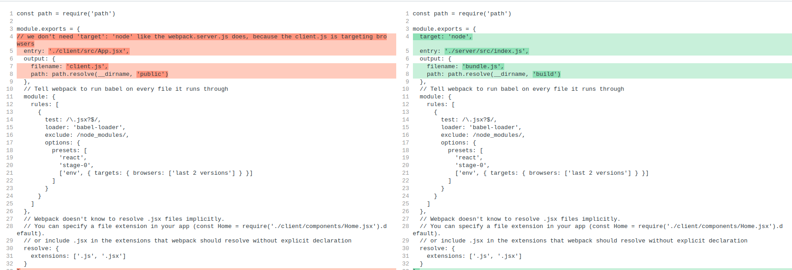
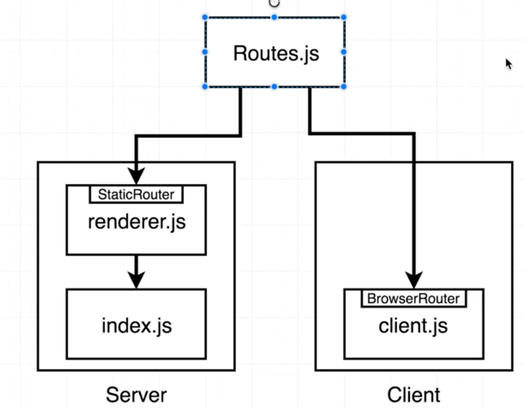

### 01. init setup for express server

server/src/index.js

```js
const express = require('express')
const React = require('react')
const renderToString = require('react-dom/server').renderToString

const Home = require('../../client/components/Home').default

const app = express()

app.get('/', (req, res) => {
  /**
     * rather than mounting React components to some DOM node
       it renders all those components exactly one time
       converts the output of them to raw HTML, and returns it as a string
     */
  const content = renderToString(<Home />)
  res.send(content)
})

app.listen(3000, () => {
  console.log('server listening on port 3000')
})
```

now if you run `yarn start` or `node src/index.js`, you will get below error `const content = renderToString(<Home />) SyntaxError: Unexpected token '<'`. This is because express by default has no idea what the JSX syntax is.

#### 02. JSX on backend server

In order to work with JSX syntax, the backend server needs webpack & babel.


```js
const path = require('path')

module.exports = {
    /**
     * we need to inform webpack to build a bundle for nodeJS
     * rather than for the browser
     */
    target: 'node',

    // root file of server application
    entry: './src/index.js',

    // where to put output file
    output: {
        filename: 'bundle.js',
        path: path.resolve(__dirname, 'build')
    },

    // run babel on every file
    // Tell webpack to run babel on every file it runs through
  module: {
    rules: [
      {
        test: /\.jsx?$/,
        loader: 'babel-loader',
        exclude: /node_modules/,
        options: {
          presets: [
            'react',
            'stage-0',
            ['env', { targets: { browsers: ['last 2 versions'] } }]
          ]
        }
      }
    ]
  },
  // Webpack doesn't know to resolve .jsx files implicitly.
  // You can specify a file extension in your app (const Home = require('./client/components/Home.jsx').default).
  // or include .jsx in the extensions that webpack should resolve without explicit declaration
  resolve: {
    extensions: ['.js', '.jsx']
  }
}
```


#### Add watch to any changes to any files, amd restart the server automatically

package.json
```json
    "scripts": {
      "start": "npm-run-all --parallel dev:build:server dev:server",
      "dev:server": "nodemon --watch build --exec \"node build/bundle.js\"",  // nodemon only watch build folder, if anything changes, run `node build/bundle.js`
      "dev:build:server": "webpack --config webpack.server.js --watch"
    },
```


#### Because we use babel now, we can use ES6 modules in our server code now

server/src/index.js
```js
import express from 'express'
import React from 'react'
import { renderToString } from 'react-dom/server'

import Home from '../../client/src/components/Home'

const app = express()

app.get('/', (req, res) => {
    /**
     * rather than mounting React components to some DOM node
       it renders all those components exactly one time
       converts the output of them to raw HTML, and returns it as a string
     */
    const content = renderToString(<Home />)
    res.send(content)
})

app.listen(3000, () => {
    console.log('server listening on port 3000')
})


```

#### The whole process of the SSR
1. App rendered on the server into some div in the 'template'
2. Rendered app sent to the users browser
3. Browser renders HTML file on the screen, the loads client bundle
4. Client bundle boots up
5. We manually render the React app a second time into the **same** div
6. React renders our app on the client side, and compares the new HTML to what already exists in the document
7. React now 'take over' the existing rendered app, binds event handlers, etc


#### Load js file after html init renderer

Now we add some event handler to the Home.jsx

```jsx
import React from 'react'

const Home = () => {
  return (
    <div>
      <div>Home Component New</div>
      <button onClick={() => console.log('Button clicked')}>Request</button>
    </div>
  )
}

export default Home
```

The html string that the server returns does not have any js code at all
```html
<div data-reactroot=""><div>Home Component New</div><button>Request</button></div>
```

Solution: we need to create 2 bundles, 1 for server and 1 for client. The server will ship the client bundle down to the browser.
One of the reason that we have 2 bundles instead of 1, is because the bundle for server may contain sensitive information for the server to use ONLY.

webpack.client.js

```js
const path = require('path')

module.exports = {
  entry: './client/src/App.jsx',
  output: {
    filename: 'client.js',
    path: path.resolve(__dirname, 'public')
  },
  // Tell webpack to run babel on every file it runs through
  module: {
    rules: [
      {
        test: /\.jsx?$/,
        loader: 'babel-loader',
        exclude: /node_modules/,
        options: {
          presets: [
            'react',
            'stage-0',
            ['env', { targets: { browsers: ['last 2 versions'] } }]
          ]
        }
      }
    ]
  },
  // Webpack doesn't know to resolve .jsx files implicitly.
  // You can specify a file extension in your app (const Home = require('./client/components/Home.jsx').default).
  // or include .jsx in the extensions that webpack should resolve without explicit declaration
  resolve: {
    extensions: ['.js', '.jsx']
  }
}

```

The difference between the client and the server webpack config file is as below:



1. the client webpack config does NOT need a `'target': 'node'` setting, because the client.js is targeting browsers
2. entry points are different
3. output file names are different
4. output paths are different. 
5. For client.js, we put is a special folder called 'public'. this folder will be used by Express.js as static resources directory, hence it is publicly available to the public.

Once the `public/client.js` is built successfully, we need to update our `server/src/index.js` to ship the client.js to browser

```js
import express from 'express'
import React from 'react'
import { renderToString } from 'react-dom/server'

import { App } from '../../client/src/App'

const app = express()

/**
 * open up the 'public' directory to the outside world, 
 * by telling Express.js to treat this public directory as a freely available public directory.
 */
app.use(express.static('public'))

app.get('/', (req, res) => {
    const content = renderToString(<App />)
    const html = `
      <html>
        <head>
          <title>Rendered from server</title>
        </head>
        <body>
          <div>${content}</div>
          <!-- browser need to retrieve the client.js from the server, by looking from the Express.js static resources directory, which in our case is the 'public' directory-->
          <script src="client.js"></script>
        </body>
      </html>
    `
    res.send(html)
})

app.listen(3000, () => {
    console.log('server listening on port 3000')
})


```

1. `app.use(express.static('public'))`, to config Express.js to treat this public directory as a freely available public directory 
2. we will send the rendered client components, plus a html template back to browser, so the browser will load the `client.js`
```js
app.get('/', (req, res) => {
    const content = renderToString(<App />)
    const html = `
      <html>
        <head>
          <title>Rendered from server</title>
        </head>
        <body>
          <div>${content}</div>
          <!-- browser need to retrieve the client.js from the server, by looking from the Express.js static resources directory, which in our case is the 'public' directory-->
          <script src="client.js"></script>
        </body>
      </html>
    `
    res.send(html)
})
```


#### Some code refactoring
1. use webpack-merge to extract common components of the webpack config files

webpack.common.js
```js
module.exports = {
  // Tell webpack to run babel on every file it runs through
  module: {
    rules: [
      {
        test: /\.jsx?$/,
        loader: 'babel-loader',
        exclude: /node_modules/,
        options: {
          presets: [
            'react',
            'stage-0',
            ['env', { targets: { browsers: ['last 2 versions'] } }]
          ]
        }
      }
    ]
  }
}
```

webpack.client.js
```js
const path = require('path')
const merge = require('webpack-merge')
const commonConfig = require('./webpack.common')

const config = {
  // we don't need 'target': 'node' like the webpack.server.js does, because the client.js is targeting browsers
  entry: './client/src/index.js',
  output: {
    filename: 'client.js',
    path: path.resolve(__dirname, 'public')
  },
  // Webpack doesn't know to resolve .jsx files implicitly.
  // You can specify a file extension in your app (const Home = require('./client/components/Home.jsx').default).
  // or include .jsx in the extensions that webpack should resolve without explicit declaration
  resolve: {
    extensions: ['.js', '.jsx']
  }
}

module.exports = merge(commonConfig, config)
```

webpack.server.js

```js
const path = require('path')
const merge = require('webpack-merge')
const commonConfig = require('./webpack.common')

const webpackNodeExternals = require('webpack-node-externals')

const config = {
  target: 'node',
  entry: './server/src/index.js',
  output: {
    filename: 'bundle.js',
    path: path.resolve(__dirname, 'build')
  },
  // to tell webpack not to bundle any libraries into our output bundle
  externals: [webpackNodeExternals()],
  // Webpack doesn't know to resolve .jsx files implicitly.
  // You can specify a file extension in your app (const Home = require('./client/components/Home.jsx').default).
  // or include .jsx in the extensions that webpack should resolve without explicit declaration
  resolve: {
    extensions: ['.js', '.jsx']
  }
} 

module.exports = merge(commonConfig, config)
```

2. run multiple scripts in parallel

```js
  "scripts": {
    "start": "npm-run-all --parallel dev:*",
    "dev:server": "nodemon --watch build --exec \"node build/bundle.js\"",
    "dev:build-server": "webpack --config webpack.server.js --watch",
    "dev:build-client": "webpack --config webpack.client.js --watch"
  },
```

3. reduce the size of the server bundle file

webpack.server.js
```js
...
externals: [webpackNodeExternals()]
...
```

This will reduce the size of the server bundle file significantly, from more than 700K down to 6K.

Webpack allows you to define externals - modules that should not be bundled.
When bundling with Webpack for the backend - you usually don't want to bundle its node_modules dependencies. This library creates an externals function that ignores node_modules when bundling in Webpack.

Webpack will load modules from the node_modules folder and bundle them in. This is fine for frontend code, but backend modules typically aren't prepared for this (i.e. using require in weird ways) or even worse are binary dependencies. We simply don't want to bundle in anything from node_modules.
[Backend Apps with Webpack](https://archive.jlongster.com/Backend-Apps-with-Webpack--Part-I)

4. refactor: extract server html rendering logic to an utility function

```js
import React from 'react'
import { renderToString } from 'react-dom/server'

import { App } from '../../../client/src/App'

export default () => {
  const content = renderToString(<App />)
  const html = `
      <html>
        <head>
          <title>Rendered from server</title>
        </head>
        <body>
          <div id="root">${content}</div>
          <!-- browser need to retrieve the client.js from the server, by looking from the Express.js static resources directory, which in our case is the 'public' directory-->
          <script src="client.js"></script>
        </body>
      </html>
    `
  return html
}

```

server/src/index.js

```js
import express from 'express'

import renderer from './utils/renderer'


const app = express()

/**
 * open up the 'public' directory to the outside world, 
 * by telling Express.js to treat this public directory as a freely available public directory.
 */
app.use(express.static('public'))

app.get('/', (req, res) => {
    res.send(renderer())
})

app.listen(3000, () => {
    console.log('server listening on port 3000')
})


```

#### Upgrade to Webpack5 and React17

package.json
```js
{
  "name": "react-ssr",
  "version": "1.0.0",
  "description": "Server side rendering project",
  "main": "index.js",
  "scripts": {
    "start": "npm-run-all -p dev:*",
    "build": "webpack --config webpack.server.js & webpack --config webpack.client.js",
    "dev:server": "nodemon --watch build --exec \"node build/server.js\"",
    "dev:build-server": "webpack --config webpack.server.js --watch",
    "dev:build-client": "webpack --config webpack.client.js --watch"
  },
  "author": "",
  "license": "ISC",
  "dependencies": {
    "@emotion/react": "^11.7.1",
    "@emotion/styled": "^11.6.0",
    "@mui/material": "^5.4.1",
    "express": "4.17.2",
    "react": "17.0.2",
    "react-dom": "17.0.2"
  },
  "devDependencies": {
    "@babel/core": "^7.17.2",
    "@babel/preset-env": "^7.16.11",
    "@babel/preset-react": "^7.16.7",
    "babel-loader": "^8.2.3",
    "nodemon": "2.0.15",
    "npm-run-all": "4.1.5",
    "terser-webpack-plugin": "^5.3.1",
    "webpack": "5.68.0",
    "webpack-cli": "^4.9.2",
    "webpack-merge": "5.8.0"
  }
}

```

Add babel.config.json

```json
{
  "presets": ["@babel/preset-env", "@babel/preset-react"],
  "plugins": []
}
```

Modify webpack config files

webpack.common.js
```js
const TerserPlugin = require('terser-webpack-plugin')

module.exports = {
  mode: 'production',
  // Tell webpack to run babel on every file it runs through
  module: {
    rules: [
      {
        test: /\.jsx?$/,
        exclude: /node_modules/,
        use: ['babel-loader']
      }
    ]
  },
  optimization: {
    minimizer: [
      new TerserPlugin({
        extractComments: false
      })
    ]
  },
  resolve: {
    extensions: ['*', '.js', '.jsx']
  }
}

```

webpack.client.js

```js
const path = require('path')
const { merge } = require('webpack-merge')
const common = require('./webpack.common')

config = {
  entry: './client/src/index.js',
  output: {
    filename: 'client.js',
    path: path.resolve(__dirname, 'public')
  }
}

module.exports = merge(common, config)

```

webpack.server.js

```js
const path = require('path')
const { merge } = require('webpack-merge')
const common = require('./webpack.common')


config = {
  target: 'node',
  entry: './server/src/index.js',
  output: {
    filename: 'server.js',
    path: path.resolve(__dirname, 'build')
  },
 
}

module.exports = merge(common, config)
```


#### Upgrade to Typescript

Step 1: install packages
```
yarn add -D typescript ts-node @types/node @types/react @types/react-dom @types/jest 
```
Step 2: Add the tsconfig.json

```
npx tsc --init
```

tsconfig.json
```json
{
  "compilerOptions": {
    "lib": ["dom", "dom.iterable", "esnext"],
    "allowJs": true,
    "allowSyntheticDefaultImports": true,
    "skipLibCheck": true,
    "esModuleInterop": true,
    "strict": true,
    "forceConsistentCasingInFileNames": true,
    "moduleResolution": "node",
    "resolveJsonModule": true,
    "isolatedModules": true,
    "noEmit": true,
    "jsx": "react"
  },
  "include": ["src"]
}
```

Here’s an explanation of the settings we have used:

lib: The standard typing to be included in the type checking process. In our case, we have chosen to use the types for the browsers DOM as well as the latest version of ECMAScript.
allowJs: Whether to allow JavaScript files to be compiled.
allowSyntheticDefaultImports: This allows default imports from modules with no default export in the type checking process.
skipLibCheck: Whether to skip type checking of all the type declaration files (*.d.ts).
esModuleInterop: This enables compatibility with Babel.
strict: This sets the level of type checking to very high. When this is true, the project is said to be running in strict mode.
forceConsistentCasingInFileNames: Ensures that the casing of referenced file names is consistent during the type checking process.
moduleResolution: How module dependencies get resolved, which is node for our project.
resolveJsonModule: This allows modules to be in .json files which are useful for configuration files.
noEmit: Whether to suppress TypeScript generating code during the compilation process. This is true in our project because Babel will be generating the JavaScript code.
jsx: Whether to support JSX in .tsx files.
include: These are the files and folders for TypeScript to check. In our project, we have specified all the files in the src folder.


Step 3: add plugins for babel

```
yarn add  -D @babel/preset-typescript @babel/plugin-transform-runtime @babel/runtime
```

@babel/core: As the name suggests, this is the core Babel library.
@babel/preset-env: This is a collection of plugins that allow us to use the latest JavaScript features but still target browsers that don’t support them.
@babel/preset-react: This is a collection of plugins that enable Babel to transform React code into JavaScript.
@babel/preset-typescript: This is a plugin that enables Babel to transform TypeScript code into JavaScript.
@babel/plugin-transform-runtime and @babel/runtime: These are plugins that allow us to use the async and await JavaScript features.

Step 4: Modify babel.config.json to add Typescript support

```json
{
  "presets": [
    "@babel/preset-env",
    "@babel/preset-react",
    "@babel/preset-typescript"
  ],
  "plugins": [
    [
      "@babel/plugin-transform-runtime",
      {
        "regenerator": true
      }
    ]
  ]
}
```

Step 5: Adding linting

```
yarn add eslint eslint-plugin-react eslint-plugin-react-hooks @typescript-eslint/parser @typescript-eslint/eslint-plugin
```
Below is an explanation of the packages that we just installed:

eslint: This is the core ESLint library.
eslint-plugin-react: This contains some standard linting rules for React code.
eslint-plugin-react-hooks: This includes some linting rules for React hooks code.
@typescript-eslint/parser: This allows TypeScript code to be linted.
@typescript-eslint/eslint-plugin: This contains some standard linting rules for TypeScript code.

Add a .eslintrc.json file in the project root

```json
{
  "parser": "@typescript-eslint/parser",
  "parserOptions": {
    "ecmaVersion": 2018,
    "sourceType": "module"
  },
  "plugins": [
    "@typescript-eslint",
    "react-hooks"
  ],
  "extends": [
    "plugin:react/recommended",
    "plugin:@typescript-eslint/recommended"
  ],
  "rules": {
    "react-hooks/rules-of-hooks": "error",
    "react-hooks/exhaustive-deps": "warn",
    "react/prop-types": "off"
  },
  "settings": {
    "react": {
      "pragma": "React",
      "version": "detect"
    }
  }
}
```

Step 6: Update webpack.common.js to add Typescript support 

```js
const TerserPlugin = require('terser-webpack-plugin')

module.exports = {
  mode: 'production',
  // Tell webpack to run babel on every file it runs through
  module: {
    rules: [
      {
        test: /\.(ts|js)x?$/,
        exclude: /node_modules/,
        use: ['babel-loader']
      }
    ]
  },
  optimization: {
    minimizer: [
      new TerserPlugin({
        extractComments: false
      })
    ]
  },
  resolve: {
    extensions: ['.tsx', '.ts', '.js', '.jsx']
  }
}

```

The entry field tells Webpack where to start looking for modules to bundle. In our project, this is index.tsx.
The module field tells Webpack how different modules will be treated. Our project is telling Webpack to use the babel-loader plugin to process files with .js, .ts, and .tsx extensions.
The resolve.extensions field tells Webpack what file types to look for in which order during module resolution.
The output field tells Webpack where to bundle our code. In our project, this is the file called bundle.js in the build folder.
The devServer field configures the Webpack development server. We are telling it that the root of the web server is the build folder, and to serve files on port 4000.


Now you can rename the React components to tsx extension.

```
.
└── src
    ├── App.tsx
    ├── components
    │   └── Home.tsx
    └── index.tsx

```

And change the entry of the webpack.client.js to use the index.tsx file as entry point

```js
const path = require('path')
const { merge } = require('webpack-merge')
const common = require('./webpack.common')

config = {
  entry: './client/src/index.tsx',
  output: {
    filename: 'client.js',
    path: path.resolve(__dirname, 'public')
  }
}

module.exports = merge(common, config)

```

Reference for adding ts support: 
[Creating React and TypeScript apps with Webpack](https://www.carlrippon.com/creating-react-and-typescript-apps-with-webpack/)

Now we can convert the server code to TypeScript

Step 7: install type definitions for express
```
yarn add -D @types/express
```

Step 8: rename server/src/index.js to index.ts

```ts
import express, { Request, Response } from 'express'

import renderer from './utils/renderer'


const app = express()

/**
 * open up the 'public' directory to the outside world, 
 * by telling Express.js to treat this public directory as a freely available public directory.
 */
app.use(express.static('public'))

app.get('/', (req: Request, res: Response) => {
  res.send(renderer())
})

app.listen(3000, () => {
    console.log('server listening on port 3000')
})


```

And modify the entry point of webpack.server.js from 'index.js' to 'index.ts'

```js
const path = require('path')
const { merge } = require('webpack-merge')
const common = require('./webpack.common')


config = {
  target: 'node',
  entry: './server/src/index.ts',
  output: {
    filename: 'server.js',
    path: path.resolve(__dirname, 'build')
  },
 
}

module.exports = merge(common, config)
```

#### StaticRouter for SSR

Solution: StaticRouter for server, and BrowserRouter for client



<StaticRouter> is a <Router> that never changes location.

This can be useful in server-side rendering scenarios when the user isn’t actually clicking around, so the location never actually changes. Hence, the name: static. It’s also useful in simple tests when you just need to plug in a location and make assertions on the render output.

Reference: [<StaticRouter>](https://v5.reactrouter.com/web/api/StaticRouter)

Step 1: Create a shared 'Routes' component, which will be shared by client and server code

shared/src/Routes.tsx

```tsx
import React, { Suspense } from "react";
import { Routes, Route } from 'react-router-dom'
import Home from '../../client/src/components/Home'
import { Loading } from '../../client/src/components/Loading'

// const HomePage = React.lazy(() => import('../../client/src/components/Home')); // Lazy-loaded

// ReactDOMServer does not yet support Suspense (and lazy)
// export default () => {
//     return (
//       <Suspense fallback={<Loading />}>
//         <Routes>
//           <Route path="/" element={<HomePage />} />
//           <Route path="/hi" element={<div>Hi</div>} />
//         </Routes>
//       </Suspense>
//     )
// }

export default () => {
    return (
      <Routes>
        <Route path="/" element={<Home />} />
        <Route path="/hi" element={<div>Hi</div>} />
      </Routes>
    )
}
```
**Note**: ReactDOMServer does not yet support Suspense (and lazy)

Step 2: Modify client side code, add `BrowserRouter`

client/src/index.tsx

```js
import React from 'react'
import ReactDom from 'react-dom'
import { BrowserRouter } from 'react-router-dom'

import Routes from '../../shared/src/Routes'

ReactDom.hydrate(
  <BrowserRouter>
    <Routes />
  </BrowserRouter>,
  document.getElementById('root')
)
```


Step 3: Modify server side code, add `StaticRouter`

server/src/utils/renderer.tsx

```tsx
import React from 'react'
import { renderToString } from 'react-dom/server'
import { StaticRouter } from 'react-router-dom/server'
import Routes from '../../../shared/src/Routes'

export default (url: string): string => {
  /**
     * rather than mounting React components to some DOM node
         it renders all those components exactly one time
        converts the output of them to raw HTML, and returns it as a string
        */
  const content = renderToString(
    // StaticRouter doesn't have the access to the browser url, hence it must read the current path from req.url
    // for determining which component need to return to the user
    <StaticRouter location={url}>
      <Routes />
    </StaticRouter>
  )
  const html = `
      <html>
        <head>
          <title>Rendered from server</title>
        </head>
        <body>
          <div id="root">${content}</div>
          <!-- browser need to retrieve the client.js from the server, by looking from the Express.js static resources directory, which in our case is the 'public' directory-->
          <script src="client.js"></script>
        </body>
      </html>
    `
  return html
}

```

And change the `server/src/index.ts`

```ts
import express, { Request, Response } from 'express'

import renderer from './utils/renderer'

const app = express()

/**
 * open up the 'public' directory to the outside world, 
 * by telling Express.js to treat this public directory as a freely available public directory.
 */
app.use(express.static('public'))

app.get('/', (req: Request, res: Response) => {
  res.send(renderer(req.url))
})

app.listen(3000, () => {
    console.log('server listening on port 3000')
})


```

Step 4: Now the server `index.ts` only has 1 route handler, which is '/'. We need to add a catch all route '*', so any route request will be handled by `shared/Routes`, which returns a React component that can be renderAsHtmlString, and return back to user's browser.


```ts
import express, { Request, Response } from 'express'

import renderer from './utils/renderer'

const app = express()

/**
 * open up the 'public' directory to the outside world, 
 * by telling Express.js to treat this public directory as a freely available public directory.
 */
app.use(express.static('public'))

app.get('/favicon.ico', (req, res) => res.status(204))

app.get('*', (req: Request, res: Response) => {
  res.send(renderer(req.url))
})

app.listen(3000, () => {
    console.log('server listening on port 3000')
})

```

Now the SSR has 2 routes, '/' -> Home component, and '/hi' -> <div>Hi</div>