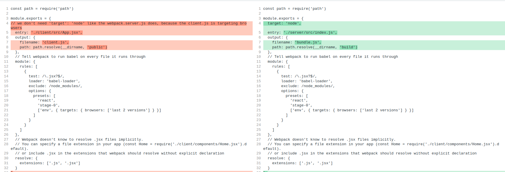

### init setup for express server

server/src/index.js

```js
const express = require('express')
const React = require('react')
const renderToString = require('react-dom/server').renderToString

const Home = require('../../client/components/Home').default

const app = express()

app.get('/', (req, res) => {
  /**
   * rather than mounting React components to some DOM node
     it renders all those components exactly one time
     converts the output of them to raw HTML, and returns it as a string
  */
  const content = renderToString(<Home />)
  res.send(content)
})

app.listen(3000, () => {
  console.log('server listening on port 3000')
})
```

now if you run `yarn start` or `node src/index.js`, you will get below error `const content = renderToString(<Home />) SyntaxError: Unexpected token '<'`. This is because express by default has no idea what the JSX syntax is.

#### 02. JSX on backend server

In order to work with JSX syntax, the backend server needs webpack & babel.


```js
const path = require('path')

module.exports = {
    /**
     * we need to inform webpack to build a bundle for nodeJS
     * rather than for the browser
     */
    target: 'node',

    // root file of server application
    entry: './src/index.js',

    // where to put output file
    output: {
        filename: 'bundle.js',
        path: path.resolve(__dirname, 'build')
    },

    // run babel on every file
    // Tell webpack to run babel on every file it runs through
  module: {
    rules: [
      {
        test: /\.jsx?$/,
        loader: 'babel-loader',
        exclude: /node_modules/,
        options: {
          presets: [
            'react',
            'stage-0',
            ['env', { targets: { browsers: ['last 2 versions'] } }]
          ]
        }
      }
    ]
  },
  // Webpack doesn't know to resolve .jsx files implicitly.
  // You can specify a file extension in your app (const Home = require('./client/components/Home.jsx').default).
  // or include .jsx in the extensions that webpack should resolve without explicit declaration
  resolve: {
    extensions: ['.js', '.jsx']
  }
}
```


#### Add watch to any changes to any files, amd restart the server automatically

package.json
```json
    "scripts": {
      "start": "npm-run-all --parallel dev:build:server dev:server",
      "dev:server": "nodemon --watch build --exec \"node build/bundle.js\"",  // nodemon only watch build folder, if anything changes, run `node build/bundle.js`
      "dev:build:server": "webpack --config webpack.server.js --watch"
    },
```


#### Because we use babel now, we can use ES6 modules in our server code now

server/src/index.js
```js
import express from 'express'
import React from 'react'
import { renderToString } from 'react-dom/server'

import Home from '../../client/src/components/Home'

const app = express()

app.get('/', (req, res) => {
    /**
     * rather than mounting React components to some DOM node
       it renders all those components exactly one time
       converts the output of them to raw HTML, and returns it as a string
     */
    const content = renderToString(<Home />)
    res.send(content)
})

app.listen(3000, () => {
    console.log('server listening on port 3000')
})


```

#### The whole process of the SSR
1. App rendered on the server into some div in the 'template'
2. Rendered app sent to the users browser
3. Browser renders HTML file on the screen, the loads client bundle
4. Client bundle boots up
5. We manually render the React app a second time into the **same** div
6. React renders our app on the client side, and compares the new HTML to what already exists in the document
7. React now 'take over' the existing rendered app, binds event handlers, etc


#### Load js file after html init renderer

Now we add some event handler to the Home.jsx

```jsx
import React from 'react'

const Home = () => {
  return (
    <div>
      <div>Home Component New</div>
      <button onClick={() => console.log('Button clicked')}>Request</button>
    </div>
  )
}

export default Home
```

The html string that the server returns does not have any js code at all
```html
<div data-reactroot=""><div>Home Component New</div><button>Request</button></div>
```

Solution: we need to create 2 bundles, 1 for server and 1 for client. The server will ship the client bundle down to the browser.
One of the reason that we have 2 bundles instead of 1, is because the bundle for server may contain sensitive information for the server to use ONLY.

webpack.client.js

```js
const path = require('path')

module.exports = {
  entry: './client/src/App.jsx',
  output: {
    filename: 'client.js',
    path: path.resolve(__dirname, 'public')
  },
  // Tell webpack to run babel on every file it runs through
  module: {
    rules: [
      {
        test: /\.jsx?$/,
        loader: 'babel-loader',
        exclude: /node_modules/,
        options: {
          presets: [
            'react',
            'stage-0',
            ['env', { targets: { browsers: ['last 2 versions'] } }]
          ]
        }
      }
    ]
  },
  // Webpack doesn't know to resolve .jsx files implicitly.
  // You can specify a file extension in your app (const Home = require('./client/components/Home.jsx').default).
  // or include .jsx in the extensions that webpack should resolve without explicit declaration
  resolve: {
    extensions: ['.js', '.jsx']
  }
}

```

The difference between the client and the server webpack config file is as below:



1. the client webpack config does NOT need a `'target': 'node'` setting, because the client.js is targeting browsers
2. entry points are different
3. output file names are different
4. output paths are different. 
5. For client.js, we put is a special folder called 'public'. this folder will be used by Express.js as static resources directory, hence it is publicly available to the public.

Once the `public/client.js` is built successfully, we need to update our `server/src/index.js` to ship the client.js to browser

```js
import express from 'express'
import React from 'react'
import { renderToString } from 'react-dom/server'

import { App } from '../../client/src/App'

const app = express()

/**
 * open up the 'public' directory to the outside world, 
 * by telling Express.js to treat this public directory as a freely available public directory.
 */
app.use(express.static('public'))

app.get('/', (req, res) => {
    const content = renderToString(<App />)
    const html = `
      <html>
        <head>
          <title>Rendered from server</title>
        </head>
        <body>
          <div>${content}</div>
          <!-- browser need to retrieve the client.js from the server, by looking from the Express.js static resources directory, which in our case is the 'public' directory-->
          <script src="client.js"></script>
        </body>
      </html>
    `
    res.send(html)
})

app.listen(3000, () => {
    console.log('server listening on port 3000')
})


```

1. `app.use(express.static('public'))`, to config Express.js to treat this public directory as a freely available public directory 
2. we will send the rendered client components, plus a html template back to browser, so the browser will load the `client.js`
```js
app.get('/', (req, res) => {
    const content = renderToString(<App />)
    const html = `
      <html>
        <head>
          <title>Rendered from server</title>
        </head>
        <body>
          <div>${content}</div>
          <!-- browser need to retrieve the client.js from the server, by looking from the Express.js static resources directory, which in our case is the 'public' directory-->
          <script src="client.js"></script>
        </body>
      </html>
    `
    res.send(html)
})
```


