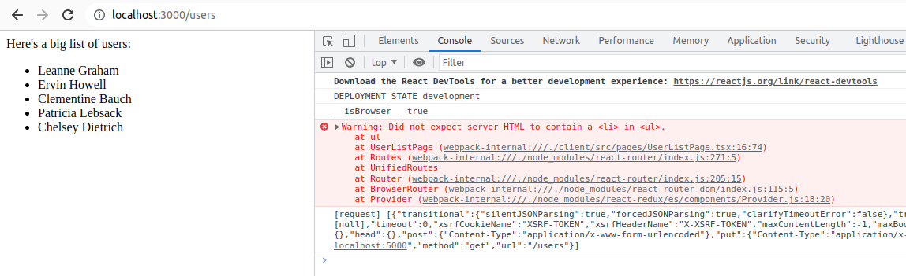
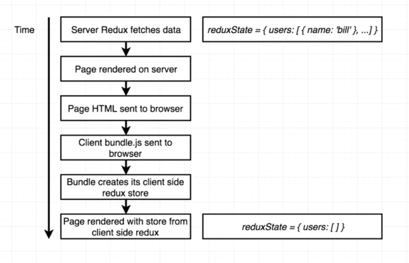
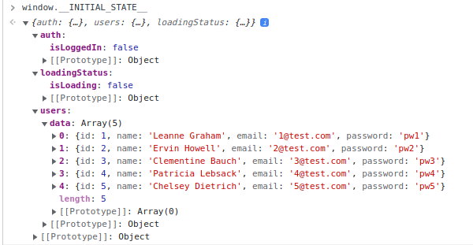
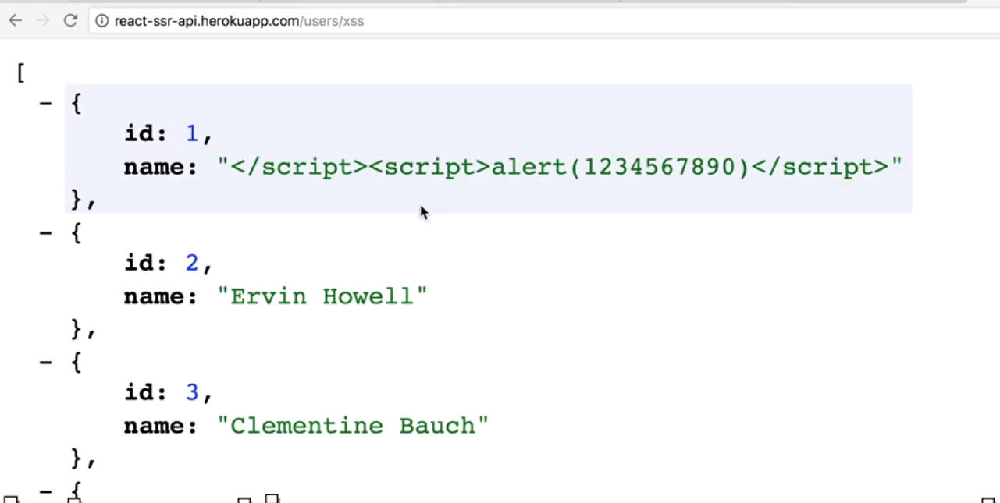

### Client State Rehydration

From last section, we have done the Redux store data loading from the server-side. However, we can see an error message in the console:


This is because the html rendered on the server-side, does not match with the html rendered on the client-side.



This is because the server-side store has users data loaded, and send the client. Then from the client-side, when client.js is loaded, it initialize its Redux store, which does NOT has any user!. (that's reason why it complaints about the html miss-match). Then it will dispatch its data loading async function to load the users into the client-side store.

In order to fix this issue, we need to add 2 more steps:
1. Server-side store dumps its state into the HTML template, before the server send the rendered html string back to the client-side
2. When client-side initialize its Redux store, it will use the server-side store state as the initial state.

#### Dump store into HTML template
Step 1: serialize the store state, then save it into `window` global object  `window.__INITIAL_STATE__`

```ts
import React from 'react'
import { AnyAction, Store } from 'redux'
import { Provider } from 'react-redux'
import { renderToString } from 'react-dom/server'
import { StaticRouter } from 'react-router-dom/server'
import { UnifiedRoutes } from '../../../shared/src/Routes'

export default (url: string, store: Store<any, AnyAction>): string => {
  /**
   * rather than mounting React components to some DOM node
     it renders all those components exactly one time
    converts the output of them to raw HTML, and returns it as a string
  */
  const content = renderToString(
    // StaticRouter doesn't have the access to the browser url, hence it must read the current path from req.url
    // for determining which component need to return to the user
    <Provider store={store}>
      <StaticRouter location={url}>
        <UnifiedRoutes />
      </StaticRouter>
    </Provider>
  )
  const html = `
      <html>
        <head>
          <title>Rendered from server</title>
        </head>
        <body>
          <div id="root">${content}</div>
          <!-- browser need to retrieve the client.js from the server, by looking from the Express.js static resources directory, which in our case is the 'public' directory-->
           <!--dumps store state into global window object-->
          <script>
            window.__INITIAL_STATE__ = ${JSON.stringify(store.getState())}
          </script>
          <script src="client.js"></script>
        </body>
      </html>
    `
  return html
}

```

**Note**: The `window.__INITIAL_STATE__ = ${JSON.stringify(store.getState())}` MUST be run before the `client.js` loads, to inject the server-side store into the window global object in the browser, otherwise the `window.__INITIAL_STATE__` is `undefined` in `client.js`

Then if you refresh the browser and check the window global object




#### Get rid of the redundant api all to retrieve users again from the client-side
Now the previous issue is fixed. However, even though we already have the latest data of users list from the server-side store, and the client store initialized its state with the user list, when the `UserListPage` component loads, it will still dispatch a api call to retrieve users list, and this api call is redundant.

However we can't delete the api call from the `UserListPage` component. Because when user navigate to other pages and then comes back, by that time the users list data may be outdated, and need to call the api again to refresh the data.


#### Fix the security flaw of the store dumps into html template


Solution: Make sure any back script won't be accidentally executed, by escaping any special characters, and replace them with their unicode equivalents. 

We use a 3pt library called `serialize-javascript` to achieve this.

```
yarn add serialize-javascript
```

then modify the `renderer` function

```ts
import React from 'react'
import { AnyAction, Store } from 'redux'
import { Provider } from 'react-redux'
import { renderToString } from 'react-dom/server'
import  serialize from 'serialize-javascript'
import { StaticRouter } from 'react-router-dom/server'
import { UnifiedRoutes } from '../../../shared/src/Routes'

export default (url: string, store: Store<any, AnyAction>): string => {
  /**
   * rather than mounting React components to some DOM node
     it renders all those components exactly one time
    converts the output of them to raw HTML, and returns it as a string
  */
  const content = renderToString(
    // StaticRouter doesn't have the access to the browser url, hence it must read the current path from req.url
    // for determining which component need to return to the user
    <Provider store={store}>
      <StaticRouter location={url}>
        <UnifiedRoutes />
      </StaticRouter>
    </Provider>
  )
  const html = `
      <html>
        <head>
          <title>Rendered from server</title>
        </head>
        <body>
          <div id="root">${content}</div>
          <!-- browser need to retrieve the client.js from the server, by looking from the Express.js static resources directory, which in our case is the 'public' directory-->
           <!--dumps store state into global window object-->
          <script>
            window.__INITIAL_STATE__ = ${serialize(store.getState())}
          </script>
          <script src="client.js"></script>
        </body>
      </html>
    `
  return html
}

```